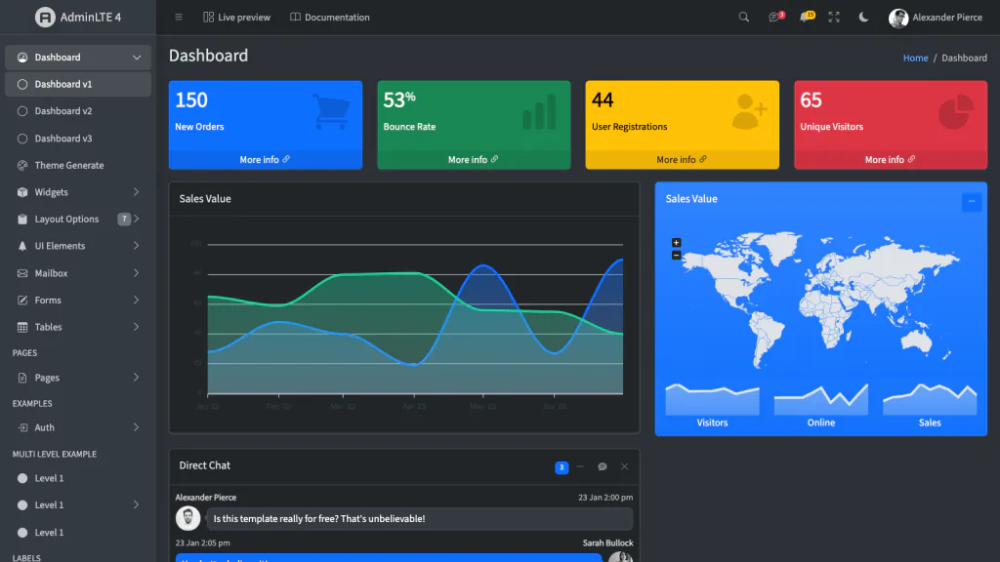
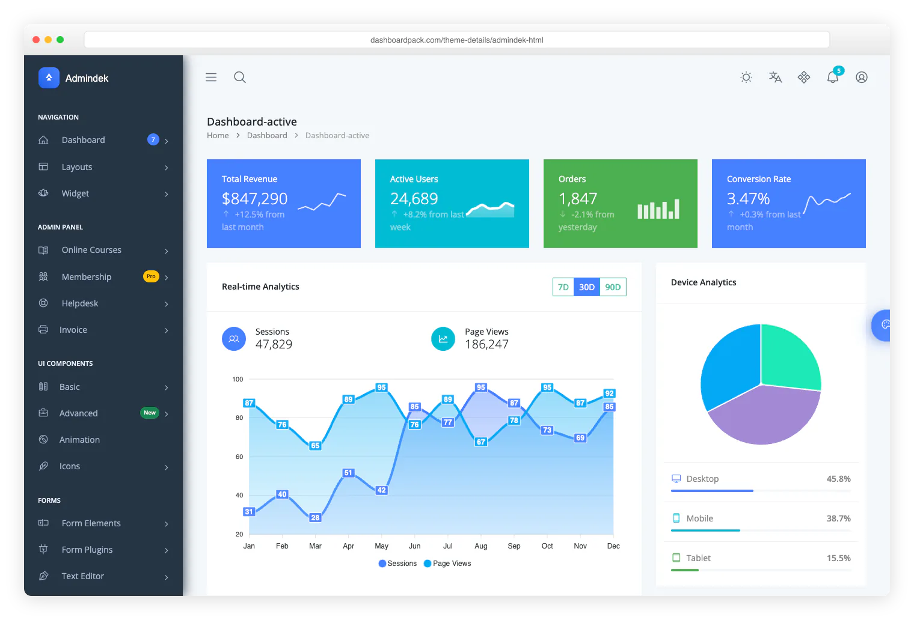
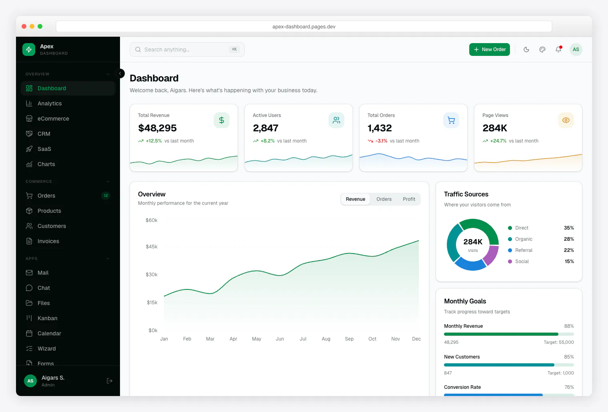
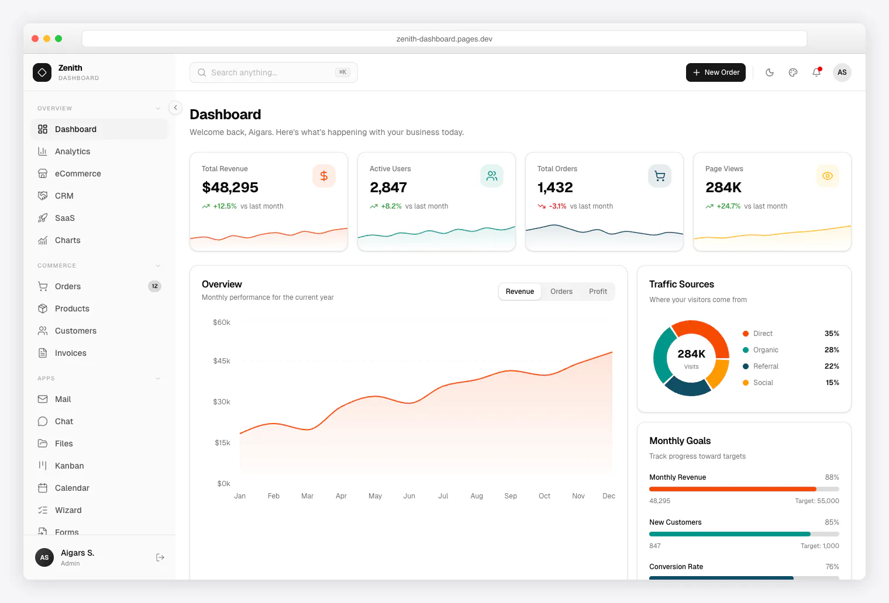
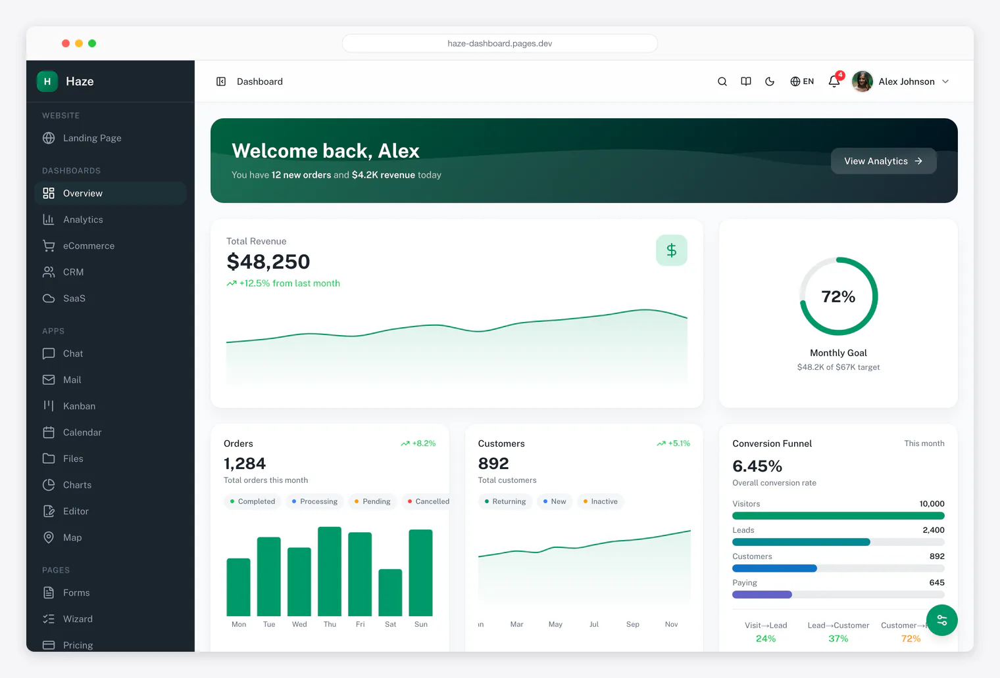

# [AdminLTE — Panel de administración con Bootstrap 5](https://adminlte.io)

[](https://www.npmjs.com/package/admin-lte)
[](https://packagist.org/packages/almasaeed2010/adminlte)
[](https://www.jsdelivr.com/package/npm/admin-lte)
[](https://opensource.org/licenses/MIT)
[](https://discord.gg/jfdvjwFqfz)
[](https://app.netlify.com/sites/adminlte-v4/deploys)

**AdminLTE** es una de las plantillas de panel de administración de código abierto más populares. Es adaptable, está creada con **[Bootstrap 5.3](https://getbootstrap.com/)** y JavaScript nativo (sin jQuery), y se puede personalizar y usar fácilmente. Se adapta a pantallas desde teléfonos hasta computadoras de escritorio y cuenta con licencia MIT.

**[Demostración en vivo](https://adminlte.io/themes/v4/)** ·
**[Documentación](https://adminlte.io/themes/v4/docs/introduction.html)** ·
**[Versiones para frameworks](#versiones-para-frameworks)** ·
**[Plantillas premium](#plantillas-premium)**

<p align="center">
  <a href="https://adminlte.io/themes/v4/">
    
  </a>
  <a href="https://adminlte.io/themes/v4/">
    
  </a>
</p>

## Versiones para frameworks

El mismo panel AdminLTE 4, integrado oficialmente con distintos frameworks. Esta es la versión principal de **HTML / Bootstrap**:

<!-- ADMINLTE-ECOSYSTEM:START -->
<div align="center">
  <a href="https://github.com/ColorlibHQ/AdminLTE"></a>
  <a href="https://github.com/ColorlibHQ/adminlte-react"></a>
  <a href="https://github.com/ColorlibHQ/adminlte-react"></a>
  <a href="https://github.com/ColorlibHQ/adminlte-vue"></a>
  <a href="https://github.com/ColorlibHQ/adminlte-vue"></a>
  <a href="https://github.com/ColorlibHQ/adminlte-angular"></a>
  <a href="https://github.com/ColorlibHQ/adminlte-laravel"></a>
  <a href="https://github.com/ColorlibHQ/adminlte-symfony"></a>
  <a href="https://github.com/ColorlibHQ/adminlte-django"></a>
  <a href="https://github.com/ColorlibHQ/adminlte-aspnet"></a>
  <a href="https://github.com/ColorlibHQ/adminlte-drupal"></a>
  <a href="https://docs.adminlte.io"></a>
</div>
<!-- ADMINLTE-ECOSYSTEM:END -->

| Versión | Repositorio | Demostración | Instalación |
|---|---|---|---|
| **HTML / Bootstrap** (este repositorio) | [AdminLTE](https://github.com/ColorlibHQ/AdminLTE) | [themes/v4](https://adminlte.io/themes/v4/) | `npm install admin-lte` |
| **React y Next.js** — más de 30 componentes tipados, listos para RSC y paleta ⌘K | [adminlte-react](https://github.com/ColorlibHQ/adminlte-react) | [themes/next-react](https://adminlte.io/themes/next-react/) | Consulta el repositorio |
| **Vue 3 y Nuxt** — más de 45 componentes tipados, composables y temas compatibles con SSR | [adminlte-vue](https://github.com/ColorlibHQ/adminlte-vue) | [themes/vue-nuxt](https://adminlte.io/themes/vue-nuxt/) | Consulta el repositorio |
| **Laravel** — componentes Blade, menú por configuración y estructura de autenticación | [adminlte-laravel](https://github.com/ColorlibHQ/adminlte-laravel) | [laravel.adminlte.io](https://laravel.adminlte.io/) | `composer require colorlibhq/adminlte-laravel` |
| **Django** — aplicación reutilizable, filtros de menú y panel con tema | [adminlte-django](https://github.com/ColorlibHQ/adminlte-django) | [django.adminlte.io](https://django.adminlte.io/) | `pip install django-adminlte4` |
| **Symfony** — componentes Twig, AssetMapper, menú por configuración y tema EasyAdmin | [adminlte-symfony](https://github.com/ColorlibHQ/adminlte-symfony) | Consulta el repositorio | `composer require colorlibhq/adminlte-symfony` |
| **Angular 22** — 44 componentes independientes con signals, modo oscuro y paleta ⌘K | [adminlte-angular](https://github.com/ColorlibHQ/adminlte-angular) | Consulta el repositorio | `npm i @adminlte/angular` |
| **ASP.NET Core (.NET 10)** — componentes Blazor y Tag Helpers para MVC/Razor Pages | [adminlte-aspnet](https://github.com/ColorlibHQ/adminlte-aspnet) | Consulta el repositorio | `dotnet add package ColorlibHQ.AdminLTE.AspNetCore` |
| **Drupal** — tema de administración para Drupal 10.3+/11 | [adminlte-drupal](https://github.com/ColorlibHQ/adminlte-drupal) | Consulta el repositorio | Consulta el repositorio |
| **Documentación** — guías, componentes y referencia de API para cada versión | [docs.adminlte.io](https://docs.adminlte.io) | [docs.adminlte.io](https://docs.adminlte.io) | — |

Todas las versiones incluyen el diseño completo de AdminLTE 4 —Bootstrap 5.3, modo oscuro y RTL— con integraciones propias de cada plataforma para componentes, rutas, autenticación y temas.

## Inicio rápido

**CDN**, sin compilación:

```html
<link rel="stylesheet" href="https://cdn.jsdelivr.net/npm/admin-lte@4/dist/css/adminlte.min.css">
<script src="https://cdn.jsdelivr.net/npm/admin-lte@4/dist/js/adminlte.min.js"></script>
```

**npm:**

```bash
npm install admin-lte@4
```

**Composer:**

```bash
composer require almasaeed2010/adminlte
```

Después, sigue la guía [Primeros pasos](https://adminlte.io/themes/v4/docs/introduction.html) o copia una de las páginas de ejemplo.

### Desarrollar AdminLTE

1. **Instala las dependencias:** `npm install`
2. **Inicia el servidor de desarrollo:** `npm start` *(abre http://localhost:3000 con recarga automática)*
3. **Compila el proyecto:** `npm run build`; o ejecuta `npm run production` para analizar, optimizar y revisar el tamaño de los paquetes.

<details>
<summary>Todos los scripts de npm</summary>

- `npm start`: inicia el servidor de desarrollo y observa los archivos.
- `npm run build`: compila los recursos para desarrollo.
- `npm run production`: ejecuta la compilación de producción, los analizadores y bundlewatch.
- `npm run lint`: ejecuta los analizadores de JS, CSS, documentación y lockfile.
- `npm run css`: compila solo CSS.
- `npm run js`: compila solo JavaScript.

</details>

## Novedades de v4

La versión 4 se reescribió desde cero con Bootstrap 5.3 y **sin jQuery**. Incluye 18 páginas nuevas de ejemplo (calendario, Kanban, chat, administrador de archivos, correo, asistente, tablas Tabulator y más), una documentación renovada y actualizaciones importantes de dependencias. Consulta el [registro de cambios](CHANGELOG.md) para ver todos los detalles.

### Novedades de 4.3

- **Búsqueda en la barra lateral**: el nuevo complemento `SidebarSearch` filtra el menú a medida que escribes, expande los submenús con coincidencias y restaura su estado al limpiar la búsqueda. Incluye un campo de búsqueda en el encabezado.
- **Cintas**: banners de esquina (`.ribbon-wrapper` + `.ribbon`) en tres tamaños, reflejados automáticamente en RTL y adaptados al radio de la tarjeta.
- **Widgets sociales y publicaciones**: `.user-block`, `.post`, `.widget-user`, `.widget-user-2` y `.description-block`, distribuidos con grid y flex.
- **Tres páginas de ejemplo nuevas**: galería con filtros sin depender de una biblioteca de imágenes, resultados de búsqueda con panel de filtros y cintas.
- **Pestañas de navegación, modales y offcanvas** en la muestra general de elementos de interfaz.
- **Páginas de documentación de tarjetas y componentes varios**, además de una receta para cambiar el idioma. Todos los componentes que incluyen CSS ahora tienen su página de referencia.

<details>
<summary>Aspectos destacados</summary>

**18 páginas de ejemplo nuevas**

- Aplicaciones: calendario (FullCalendar), Kanban (SortableJS), chat, administrador de archivos, proyectos y correo (bandeja de entrada, lectura y redacción).
- Formularios: asistente de cuatro pasos con validación.
- Tablas: tablas de datos con Tabulator, sin jQuery.
- Páginas: perfil, configuración, factura, precios y preguntas frecuentes.
- Errores: 404, 500 y mantenimiento.

**Renovación de la documentación**

- Páginas nuevas: primeros pasos, personalización y temas, compatibilidad con RTL, migración desde v3, esquema del diseño, recetas, implementación y rendimiento, integraciones recomendadas y resumen de complementos JavaScript.
- Introducción reescrita con cuatro métodos de instalación (CDN, npm, código fuente y Composer).
- Preguntas frecuentes renovadas con encabezado, búsqueda en vivo, filtros por sección y un acordeón de 23 preguntas.
- Navegación lateral separada: la demostración del panel y la documentación tienen sus propios menús.

**Actualizaciones importantes de dependencias**

- ESLint 10, TypeScript 6, Stylelint 17, Astro 6.3, Bootstrap 5.3.8 y Node 22 LTS en CI.
- `npm install` termina sin errores y con **0 vulnerabilidades**.

</details>

<details>
<summary>Cambios incompatibles respecto a v3</summary>

- Nombres de clases: `.wrapper` → `.app-wrapper`, `.main-header` → `.app-header`, `.main-sidebar` → `.app-sidebar`, `.content-wrapper` → `.app-main`.
- Atributos de datos: `data-toggle` → `data-bs-toggle`, `data-widget="pushmenu"` → `data-lte-toggle="sidebar"`, `data-widget="treeview"` → `data-lte-toggle="treeview"`.
- Modo oscuro: la clase `.dark-mode` de `body` se reemplaza por el atributo nativo de Bootstrap 5.3 `data-bs-theme="dark"`.
- Ya no se necesita jQuery; los complementos están escritos en TypeScript nativo.
- Se eliminó la carpeta `plugins/`. Cada widget de jQuery de v3 tiene una alternativa documentada en JavaScript nativo ([tabla de reemplazos](https://adminlte.io/themes/v4/docs/migration.html#third-party-plugin-replacements): Select2 → Tom Select, DataTables → Tabulator, Summernote → Quill, entre otros).
Los colores adicionales de v3 (`.bg-navy`, `.bg-teal`, los temas de la barra lateral, etc.) están en hojas de estilos opcionales: `dist/css/adminlte-colors.css` incluye catorce colores rediseñados legibles con texto blanco, 17 temas y un hook para el color de marca; `dist/css/adminlte-colors-v3.css` conserva exactamente los 18 colores de AdminLTE 3. Ambas hojas permiten elegir un color como `primary` de Bootstrap. Con `<html data-lte-primary="teal">` se recolorean botones, enlaces, paginación y el foco de formularios ([documentación de colores](https://adminlte.io/themes/v4/docs/colors.html), [demostración en vivo](https://adminlte.io/themes/v4/UI/colors.html)). No se agrega nada a `adminlte.css`.

Consulta la guía específica de [Migración desde v3](https://adminlte.io/themes/v4/docs/migration.html).

</details>

## Plantillas premium

AdminLTE siempre será gratuito y de código abierto. Si un proyecto necesita más —páginas listas para una aplicación, código adaptado a un framework o asistencia dedicada—, nuestro equipo selecciona paneles premium en **[adminlte.io/premium](https://adminlte.io/premium)**, incluidas versiones para las mismas plataformas con las que se integra AdminLTE:

<table>
  <tr>
    <td align="center" width="50%">
      <a href="https://dashboardpack.com/theme-details/admindek-html/?utm_source=github&utm_medium=readme&utm_campaign=adminlte">
        
      </a>
      <br>
      <a href="https://dashboardpack.com/theme-details/admindek-html/?utm_source=github&utm_medium=readme&utm_campaign=adminlte"><strong>Admindek</strong></a>
      <br>
      <sub>El siguiente paso después de AdminLTE: Bootstrap 5 y JavaScript nativo, más de 100 componentes, modos claro y oscuro, RTL y 10 paletas de colores.<br>
      También disponible para <a href="https://dashboardpack.com/theme-details/admindek-dashboard-laravel/?utm_source=github&utm_medium=readme&utm_campaign=adminlte">Laravel</a> ·
      <a href="https://dashboardpack.com/theme-details/admindek-nextjs/?utm_source=github&utm_medium=readme&utm_campaign=adminlte">Next.js</a> ·
      <a href="https://dashboardpack.com/theme-details/admindek-dashboard-angular/?utm_source=github&utm_medium=readme&utm_campaign=adminlte">Angular</a></sub>
    </td>
    <td align="center" width="50%">
      <a href="https://dashboardpack.com/theme-details/apex-dashboard-nextjs/?utm_source=github&utm_medium=readme&utm_campaign=adminlte">
        
      </a>
      <br>
      <a href="https://dashboardpack.com/theme-details/apex-dashboard-nextjs/?utm_source=github&utm_medium=readme&utm_campaign=adminlte"><strong>Apex Dashboard</strong></a>
      <br>
      <sub>5 variantes de panel, más de 20 páginas de aplicación, más de 125 rutas y CRUD completo en el stack nativo de tu backend.<br>
      For <a href="https://dashboardpack.com/theme-details/apex-dashboard-nextjs/?utm_source=github&utm_medium=readme&utm_campaign=adminlte">Next.js</a> ·
      <a href="https://dashboardpack.com/theme-details/apex-dashboard-laravel/?utm_source=github&utm_medium=readme&utm_campaign=adminlte">Laravel</a> ·
      <a href="https://dashboardpack.com/theme-details/apex-dashboard-django/?utm_source=github&utm_medium=readme&utm_campaign=adminlte">Django</a> ·
      <a href="https://dashboardpack.com/theme-details/apex-dashboard-angular/?utm_source=github&utm_medium=readme&utm_campaign=adminlte">Angular</a></sub>
    </td>
  </tr>
  <tr>
    <td align="center" width="50%">
      <a href="https://dashboardpack.com/theme-details/zenith-dashboard-django/?utm_source=github&utm_medium=readme&utm_campaign=adminlte">
        
      </a>
      <br>
      <a href="https://dashboardpack.com/theme-details/zenith-dashboard-django/?utm_source=github&utm_medium=readme&utm_campaign=adminlte"><strong>Zenith Dashboard — Django</strong></a>
      <br>
      <sub>Diseño acromático y minimalista en un proyecto Django listo para ejecutar: más de 50 páginas, 6 paneles y personalizador de temas en vivo.</sub>
    </td>
    <td align="center" width="50%">
      <a href="https://dashboardpack.com/theme-details/haze-dashboard-nuxt/?utm_source=github&utm_medium=readme&utm_campaign=adminlte">
        
      </a>
      <br>
      <a href="https://dashboardpack.com/theme-details/haze-dashboard-nuxt/?utm_source=github&utm_medium=readme&utm_campaign=adminlte"><strong>Haze — Nuxt</strong></a>
      <br>
      <sub>Nuxt 4, Nuxt UI v4 y Tailwind CSS v4. Más de 92 páginas, 7 diseños, 5 paneles, RTL, i18n y una capa de API simulada.</sub>
    </td>
  </tr>
</table>

<p align="center">
  <a href="https://adminlte.io/premium"><strong>Ver todas las plantillas premium →</strong></a>
</p>

## Compatibilidad con navegadores y plataformas

AdminLTE es compatible con las últimas versiones de los navegadores modernos (Chrome, Firefox, Safari y Edge) mediante Bootstrap 5.3.8. Los scripts de compilación funcionan en Windows (CMD, PowerShell y Git Bash), macOS y Linux gracias a las utilidades multiplataforma de npm.

## Seguridad e implementación en producción

AdminLTE es una **plantilla de interfaz**. Publica únicamente los recursos compilados de producción (`dist/js/adminlte.min.js`, `dist/css/adminlte.min.css`) y los archivos de tu aplicación. No publiques `node_modules/`, las páginas HTML de demostración ni el directorio `src/`.

> **Acerca de CVE-2021-36471:** esta CVE está **disputada** y no representa una vulnerabilidad de AdminLTE. Se refiere al acceso a páginas de demostración cuando se publican por error en producción. AdminLTE v4 separa las demostraciones de desarrollo de los recursos de producción.

Consulta [SECURITY.md](SECURITY.md) para ver recomendaciones detalladas, requisitos de autenticación y buenas prácticas.

## Patrocinio

Apoya el desarrollo de AdminLTE mediante un patrocinio o una donación.

<p align="center">
  <a href="https://github.com/sponsors/danny007in">
    
  </a>
  &nbsp;&nbsp;
  <a href="https://www.paypal.me/daniel007in">
    
  </a>
</p>

### Patrocinadores

<p align="center">
  <a href="https://github.com/spizzo14"></a>&nbsp;&nbsp;
  <a href="https://github.com/tomhappyblock"></a>&nbsp;&nbsp;
  <a href="https://github.com/stefanmorderca"></a>&nbsp;&nbsp;
  <a href="https://github.com/tito10047"></a>&nbsp;&nbsp;
  <a href="https://github.com/sitchi"></a>&nbsp;&nbsp;
  <a href="https://github.com/npreee"></a>&nbsp;&nbsp;
  <a href="https://github.com/isaacmorais"></a>&nbsp;&nbsp;
</p>

<p align="center">
  <a href="https://github.com/sponsors/danny007in">¿Quieres ver tu avatar aquí? Conviértete en patrocinador</a>
</p>

## Cómo contribuir

Todas las contribuciones son bienvenidas:

1. Instala [Node.js](https://nodejs.org/) (LTS) y clona este repositorio (rama `master`).
2. Ejecuta `npm install` y luego `npm start` para iniciar el servidor de desarrollo.
3. Haz los cambios, ejecuta `npm run lint` antes de confirmarlos y abre un PR contra `master`.

## Licencia

AdminLTE es un proyecto de código abierto de [AdminLTE.io](https://adminlte.io), distribuido bajo la licencia [MIT](https://opensource.org/licenses/MIT). AdminLTE.io se reserva el derecho de cambiar la licencia de futuras versiones.

## Créditos de imágenes

[Pixeden](http://www.pixeden.com/psd-web-elements/flat-responsive-showcase-psd),
[Graphicsfuel](https://www.graphicsfuel.com/2013/02/13-high-resolution-blur-backgrounds/),
[Pickaface](https://pickaface.net/),
[Unsplash](https://unsplash.com/),
[Uifaces](http://uifaces.com/),
[Unavatar](https://unavatar.io/)
